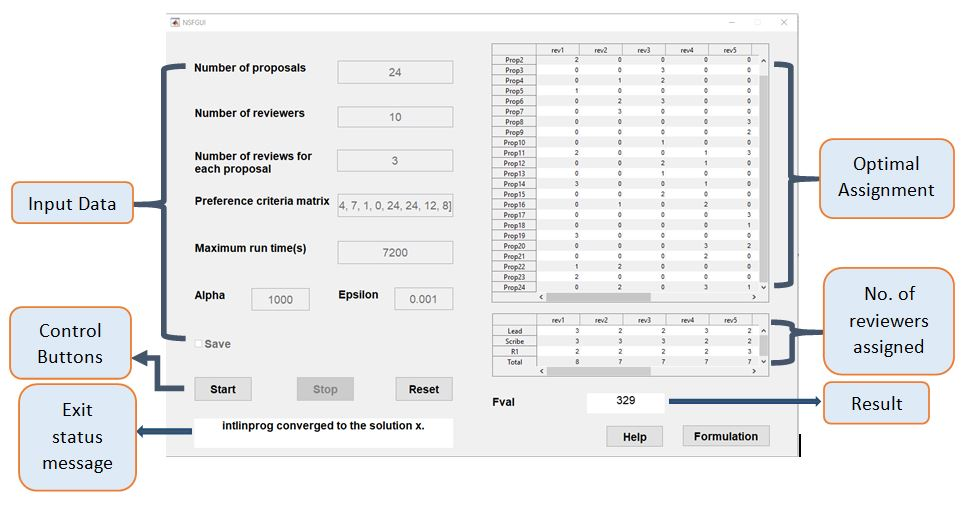

# NSF-Panel-Assignment
A Graphic User Interface is built for NSF Panel assignment problem .
A GUI is developed to efficiently analyze the inputs, solve the problem and also provide a detailed analysis of the solution without requiring any in-depth knowledge of the solution procedure or optimization solvers.

## The panel assignment problem can be defined as follows. 
#### Given:
- the number of available reviewers,
- the number of proposals in the panel,
- the number of reviews needed for each proposal, and
- a matrix of preferences for each reviewer on each proposal,

#### we want to determine an assignment of reviewers to proposals on the panel so as to optimize the sum of the preferences for each reviewers assigned proposals.
#### In addition, there are several requirements that must be met as follows:
- each reviewer must be assigned to approximately the same number of proposals,
- each proposal must be reviewed the same number of times,
- reviewers that have a "conflict of interest" (COI) with a proposal must not be assigned to that proposal, and
- each proposal has three or four distinct positions (LEAD, SCRIBE, REV1, REV2) and each position must be filled exactly once for each proposal and each reviewer must be assigned to each position approximately the same number of times. 
- In addition, the assignment of reviewers to positions should follow the preferences of each reviewer for a proposal so that the preference of the reviewer assigned to the LEAD position for a proposal is less than the preference of the reviewer assigned to the SCRIBE position. 
- Similarly, the preference of the reviewer assigned to the SCRIBE position for a proposal is less than the preference of the reviewer assigned to the REV1 position and the preference of the reviewer assigned to the REV1 position for a proposal is less than the preference of the reviewer assigned to the REV2 position.

For the linear integer programming problem formulation of the problem, please refer to the following publication:

> Stacy L. Janak, Martin Taylor, and Christodoulos A. Floudas, Maria Burka, and T. J. Mountziaris. Novel and Effective Integer Optimization Approach for the NSF Panel-Assignment Problem: A Multiresource and Preference-Constrained Generalized Assignment Problem. Industrial and Engineering Chemistry Research, 2006, 45, 258-265.

## GUI
In the GUI interface, the required data such the number of available reviewers, the number of proposals in the panel, the number of reviews needed for each proposal, a matrix of preferences for each reviewer on each proposal are the inputs to be provided by the user.
The user can set the maximum run time, which if exceeded by the intlinprogleads to premature termination of the solver. It is set to 7200 seconds by default

There are three push buttons, namely Start, Reset and Stop. The Start button triggers the program to run, whereas the Reset button is used to clear all the data input by the user. The Stop button helps the user to terminate the execution of the program. While the program is executing, an un-editable textbox appears on the screen stating the status of execution. This textbox also displays the exit condition of the program.

